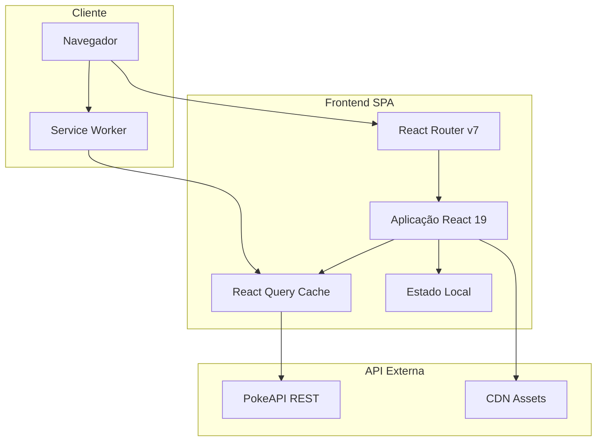
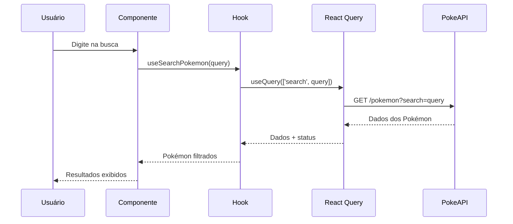
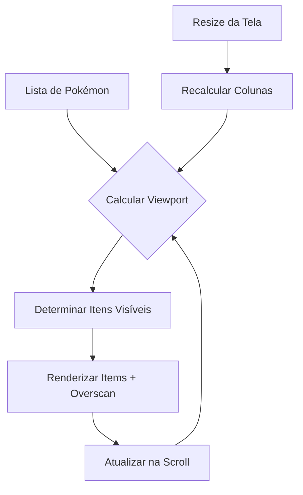

# Arquitetura do Sistema - PokéYampa

## 📋 Índice

- [Visão Geral](#-visão-geral)
- [Arquitetura de Alto Nível](#-arquitetura-de-alto-nível)
- [Camadas da Aplicação](#-camadas-da-aplicação)
- [Fluxo de Dados](#-fluxo-de-dados)
- [Gerenciamento de Estado](#-gerenciamento-de-estado)
- [Padrões de Design](#-padrões-de-design)
- [Performance e Otimização](#-performance-e-otimização)
- [Segurança](#-segurança)
- [Escalabilidade](#-escalabilidade)

## 🎯 Visão Geral

PokéYampa é uma Single Page Application (SPA) construída com uma arquitetura moderna e componentizada que prioriza performance, acessibilidade e manutenibilidade. A arquitetura segue princípios de separação de responsabilidades e design orientado a componentes.

### Princípios Arquiteturais

- **Component-Driven Development**: Desenvolvimento orientado a componentes isolados
- **Performance-First**: Otimização como requisito fundamental
- **Accessibility-First**: Acessibilidade considerada desde o design
- **Type-Safe**: TypeScript com modo estrito em toda a aplicação
- **Test-Driven**: Cobertura de testes abrangente

## 🏗️ Arquitetura de Alto Nível



### Componentes Principais

| Componente | Responsabilidade | Tecnologia |
|------------|------------------|------------|
| **React Router** | Roteamento client-side | React Router v7 |
| **React Query** | Cache e sincronização de dados | @tanstack/react-query |
| **Component System** | Interface de usuário | shadcn/ui + Radix UI |
| **State Management** | Estado da aplicação | React hooks + Context |
| **API Layer** | Comunicação com APIs | Axios + Zod |
| **Build System** | Empacotamento e otimização | Vite + TypeScript |

## 🔄 Camadas da Aplicação

### 1. Camada de Apresentação (UI Layer)

```
src/components/
├── ui/                 # Componentes base (shadcn/ui)
│   ├── button/
│   ├── card/
│   ├── dialog/
│   └── ...
├── pokemon-card/       # Componentes específicos do domínio
├── carousel-image/
└── loading/
```

**Responsabilidades:**
- Renderização de componentes visuais
- Manipulação de eventos de usuário
- Estados locais de UI (loading, hover, focus)
- Acessibilidade e navegação por teclado

**Padrões Utilizados:**
- **Compound Components**: Para componentes complexos como Accordion
- **Render Props**: Para lógica reutilizável de renderização
- **Composition over Inheritance**: Composição de componentes pequenos

### 2. Camada de Lógica de Negócio (Hooks Layer)

```
src/hooks/
├── use-list-pokemons.ts      # Lógica de listagem e paginação
├── use-search-pokemon.ts     # Lógica de busca
├── use-detail-pokemon.ts     # Lógica de detalhes
└── use-screen-size.ts        # Lógica de responsividade
```

**Responsabilidades:**
- Encapsular lógica complexa de negócio
- Gerenciar estado local e efeitos colaterais
- Integrar com APIs e cache
- Fornecer interface consistente para componentes

**Benefícios:**
- **Reutilização**: Lógica compartilhada entre componentes
- **Testabilidade**: Fácil isolamento para testes
- **Separação de Responsabilidades**: UI separada da lógica

### 3. Camada de Dados (Data Layer)

```
src/services/
├── api.ts                    # Configuração do cliente HTTP
├── pokemon.ts                # Serviços específicos de Pokémon
└── pokemon-detail.ts         # Serviços de detalhes
```

**Responsabilidades:**
- Comunicação com APIs externas
- Transformação e validação de dados
- Tratamento de erros de rede
- Cache e persistência

**Tecnologias:**
- **Axios**: Cliente HTTP com interceptadores
- **Zod**: Validação e transformação de dados
- **React Query**: Cache inteligente e sincronização

### 4. Camada de Estado (State Layer)

#### Estado do Servidor (React Query)
```typescript
// Cache hierárquico para dados da API
const pokemonsQuery = useInfiniteQuery({
  queryKey: ['pokemons'],
  queryFn: ({ pageParam = 0 }) => fetchPokemons(pageParam),
  staleTime: 5 * 60 * 1000, // 5 minutos
  cacheTime: 30 * 60 * 1000, // 30 minutos
});
```

#### Estado Local (React Hooks)
```typescript
// Estado específico de componentes
const [searchTerm, setSearchTerm] = useState('');
const [isDrawerOpen, setIsDrawerOpen] = useState(false);
const [selectedPokemon, setSelectedPokemon] = useState(null);
```

## 📊 Fluxo de Dados

### Fluxo de Busca de Pokémon



### Fluxo de Virtualização



## 🔄 Gerenciamento de Estado

### Estratégia de Estado

| Tipo de Estado | Tecnologia | Exemplo |
|---------------|------------|---------|
| **Servidor** | React Query | Lista de Pokémon, detalhes |
| **Global UI** | Context API | Tema, idioma |
| **Local UI** | useState | Modais, formulários |
| **Computado** | useMemo | Filtros, ordenação |
| **URL** | React Router | Página atual, parâmetros |

### Padrões de Gerenciamento

#### 1. Colocação de Estado (State Colocation)
```typescript
// Estado próximo ao uso
function PokemonCard({ pokemon }) {
  const [isHovered, setIsHovered] = useState(false);
  // Estado usado apenas neste componente
}
```

#### 2. Elevação de Estado (State Lifting)
```typescript
// Estado compartilhado entre componentes irmãos
function PokemonList() {
  const [selectedPokemon, setSelectedPokemon] = useState(null);
  
  return (
    <>
      <PokemonGrid onSelect={setSelectedPokemon} />
      <PokemonDrawer pokemon={selectedPokemon} />
    </>
  );
}
```

#### 3. Estado Derivado
```typescript
// Estado computado a partir de outros estados
const filteredPokemon = useMemo(() => 
  allPokemon.filter(pokemon => 
    pokemon.name.toLowerCase().includes(searchTerm.toLowerCase())
  ), [allPokemon, searchTerm]
);
```

## 🎨 Padrões de Design

### 1. Compound Components

```typescript
// Accordion como exemplo de compound component
<Accordion type="single" collapsible>
  <AccordionItem value="stats">
    <AccordionTrigger>Estatísticas</AccordionTrigger>
    <AccordionContent>
      <PokemonStats stats={pokemon.stats} />
    </AccordionContent>
  </AccordionItem>
</Accordion>
```

**Benefícios:**
- API flexível e componível
- Controle fino sobre renderização
- Fácil customização e extensão

### 2. Custom Hooks Pattern

```typescript
// Encapsulamento de lógica complexa
function useListPokemons() {
  const [searchTerm, setSearchTerm] = useState('');
  const { data, isLoading, error } = useInfiniteQuery({
    queryKey: ['pokemons', searchTerm],
    queryFn: ({ pageParam }) => fetchPokemons(pageParam, searchTerm),
  });
  
  const virtualizer = useVirtualizer({
    count: Math.ceil((data?.pages.length || 0) / columns),
    getScrollElement: () => parentRef.current,
    estimateSize: getEstimatedSize,
  });
  
  return {
    pokemonsQuery: { data, isLoading, error },
    searchTerm,
    setSearchTerm,
    virtualizer,
  };
}
```

### 3. Higher-Order Components (HOCs)

```typescript
// Wrapper para tratamento de erro
function withErrorBoundary<T>(Component: React.ComponentType<T>) {
  return function WithErrorBoundaryComponent(props: T) {
    return (
      <ErrorBoundary fallback={<ErrorFallback />}>
        <Component {...props} />
      </ErrorBoundary>
    );
  };
}
```

### 4. Render Props com Virtualização

```typescript
// Virtualização com render props
<VirtualList
  items={pokemonList}
  itemHeight={200}
  render={({ item, index, style }) => (
    <div style={style}>
      <PokemonCard key={item.id} pokemon={item} />
    </div>
  )}
/>
```

## ⚡ Performance e Otimização

### Estratégias de Performance

#### 1. Virtualização de Listas
```typescript
// @tanstack/react-virtual para listas grandes
const virtualizer = useVirtualizer({
  count: pokemonCount,
  getScrollElement: () => parentRef.current,
  estimateSize: () => 250, // altura estimada do item
  overscan: 5, // itens extras para scroll suave
});
```

#### 2. Code Splitting
```typescript
// Divisão por rotas
const Home = lazy(() => import('./pages/home'));
const NotFound = lazy(() => import('./pages/not-found'));

// Divisão por componentes grandes
const PokemonDetailDrawer = lazy(() => 
  import('./components/pokemon-detail-drawer')
);
```

#### 3. Bundle Optimization
```typescript
// vite.config.ts - Chunks manuais
build: {
  rollupOptions: {
    output: {
      manualChunks: {
        vendor: ['react', 'react-dom'],
        query: ['@tanstack/react-query'],
        ui: ['@radix-ui/react-dialog', '@radix-ui/react-tabs'],
        router: ['react-router'],
        utils: ['clsx', 'tailwind-merge'],
      }
    }
  }
}
```

#### 4. Memoização e Otimização de Re-renderização
```typescript
// React.memo para componentes puros
const PokemonCard = React.memo(({ pokemon }) => {
  // Component implementation
});

// useMemo para cálculos caros
const sortedPokemon = useMemo(() => 
  pokemon.sort((a, b) => a.name.localeCompare(b.name)),
  [pokemon]
);

// useCallback para funções estáveis
const handlePokemonSelect = useCallback((pokemon) => {
  setSelectedPokemon(pokemon);
}, []);
```

### Métricas de Performance

| Métrica | Meta | Atual |
|---------|------|-------|
| **First Contentful Paint** | <1.5s | ~1.2s |
| **Largest Contentful Paint** | <2.5s | ~2.1s |
| **Cumulative Layout Shift** | <0.1 | ~0.05 |
| **Time to Interactive** | <3s | ~2.8s |
| **Bundle Size (gzipped)** | <500KB | ~420KB |

## 🔒 Segurança

### Práticas de Segurança Implementadas

#### 1. Validação de Dados
```typescript
// Zod para validação runtime
const PokemonSchema = z.object({
  id: z.number().min(1),
  name: z.string().min(1),
  types: z.array(z.string()),
  sprites: z.object({
    front_default: z.string().url(),
  }),
});

// Validação na entrada de dados
export function validatePokemonData(data: unknown): IPokemon {
  return PokemonSchema.parse(data);
}
```

#### 2. Sanitização de HTML
```typescript
// Prevenção de XSS em conteúdo dinâmico
function sanitizeHtml(content: string): string {
  return content
    .replace(/</g, '&lt;')
    .replace(/>/g, '&gt;')
    .replace(/"/g, '&quot;');
}
```

#### 3. Content Security Policy
```typescript
// Configuração CSP para produção
const cspDirectives = {
  'default-src': ["'self'"],
  'img-src': ["'self'", 'https://pokeapi.co', 'https://raw.githubusercontent.com'],
  'style-src': ["'self'", "'unsafe-inline'"],
  'script-src': ["'self'"],
};
```

#### 4. Tratamento de Erros Seguro
```typescript
// Não exposição de informações sensíveis
function handleApiError(error: AxiosError) {
  const safeError = {
    message: 'Erro ao carregar dados',
    status: error.response?.status || 500,
    // Não expor stack trace ou dados internos
  };
  
  return safeError;
}
```

## 📈 Escalabilidade

### Estratégias de Escalabilidade

#### 1. Arquitetura Modular
```
src/
├── features/           # Funcionalidades por domínio
│   ├── pokemon/
│   │   ├── components/
│   │   ├── hooks/
│   │   ├── services/
│   │   └── types/
│   └── search/
├── shared/            # Código compartilhado
│   ├── ui/
│   ├── hooks/
│   └── utils/
└── core/              # Configurações centrais
```

#### 2. Lazy Loading e Code Splitting
```typescript
// Carregamento sob demanda por funcionalidade
const PokemonFeature = lazy(() => import('./features/pokemon'));
const SearchFeature = lazy(() => import('./features/search'));
```

#### 3. Caching Estratégico
```typescript
// Cache em múltiplas camadas
const queryClient = new QueryClient({
  defaultOptions: {
    queries: {
      staleTime: 5 * 60 * 1000,    // 5 minutos
      cacheTime: 30 * 60 * 1000,   // 30 minutos
      retry: 3,
      retryDelay: attemptIndex => Math.min(1000 * 2 ** attemptIndex, 30000),
    },
  },
});
```

#### 4. Performance Monitoring
```typescript
// Métricas de performance customizadas
function trackPerformanceMetric(name: string, value: number) {
  if ('performance' in window && 'measure' in performance) {
    performance.mark(`${name}-start`);
    performance.mark(`${name}-end`);
    performance.measure(name, `${name}-start`, `${name}-end`);
  }
}
```

### Pontos de Extensão

#### 1. Novos Tipos de Dados
```typescript
// Interface extensível para novos dados
interface IPokemonExtended extends IPokemon {
  abilities?: IAbility[];
  moves?: IMove[];
  evolutionChain?: IEvolution[];
}
```

#### 2. Novos Componentes de UI
```typescript
// Sistema de componentes extensível
export interface IComponentVariants {
  size: 'sm' | 'md' | 'lg';
  variant: 'default' | 'outline' | 'ghost';
  theme: 'light' | 'dark';
}
```

#### 3. Novas Funcionalidades
```typescript
// Hooks extensíveis para novas funcionalidades
function useAdvancedSearch() {
  // Implementação para busca avançada
}

function useComparison() {
  // Implementação para comparação de Pokémon
}
```

## 🔧 Ferramentas de Desenvolvimento

### Build e Bundling
- **Vite**: Build tool com HMR rápido
- **TypeScript**: Compilação e verificação de tipos
- **ESBuild**: Minificação e transpilação

### Qualidade de Código
- **ESLint**: Linting e verificação de código
- **Prettier**: Formatação automática
- **Husky**: Pre-commit hooks

### Testes
- **Vitest**: Testes unitários
- **Testing Library**: Testes de componentes
- **Cypress**: Testes end-to-end
- **Chromatic**: Testes visuais

### Documentação
- **Storybook**: Documentação de componentes
- **TypeDoc**: Documentação de APIs
- **Markdown**: Documentação geral

## 📝 Considerações Finais

A arquitetura do PokéYampa foi projetada para ser:

- **Escalável**: Suporta crescimento de funcionalidades e dados
- **Manutenível**: Código organizado e bem documentado
- **Performática**: Otimizações em múltiplas camadas
- **Testável**: Componentes isolados e testáveis
- **Acessível**: Conformidade com padrões de acessibilidade

Esta arquitetura serve como base sólida para evolução contínua do projeto, permitindo adição de novas funcionalidades sem comprometer a qualidade ou performance existente. 